## Status

[](https://wakatime.com/@03bdf8cf-415d-486f-8326-1cb2a1c43d7d)

- Golang is life, CrabLang is dream.
- Have five internship experience, also be rejected by many companies.

```
Life is a journey of your own.
```

## Dev Environment

  

## Server Environment

   
